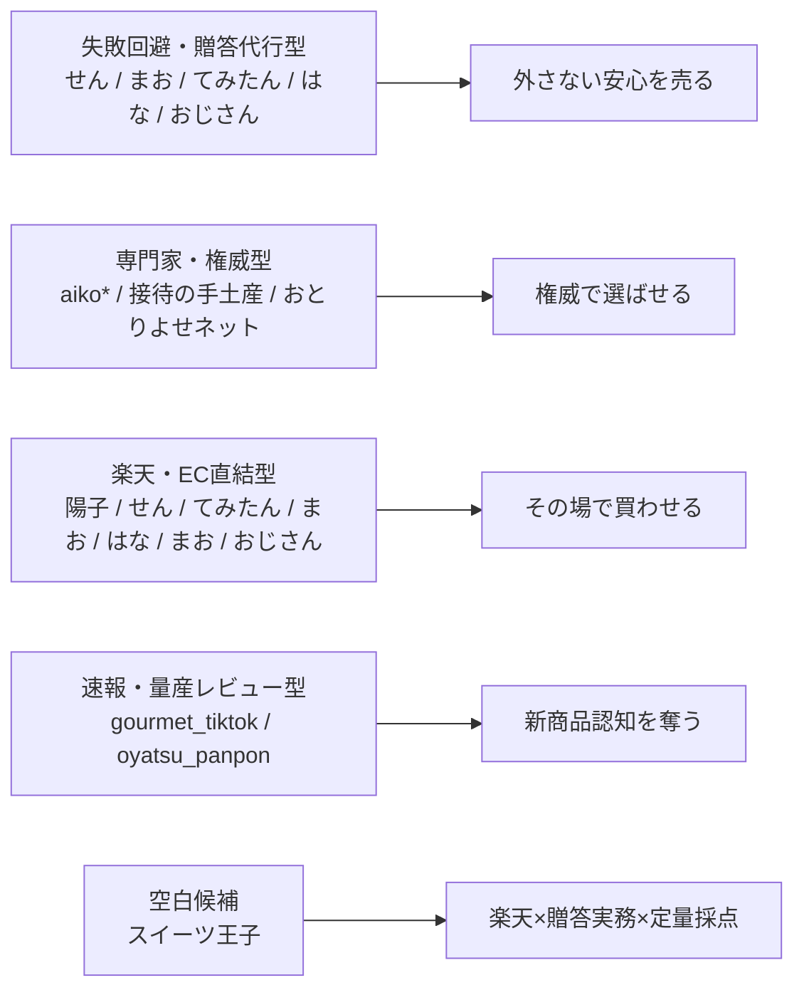

# Threadsのスイーツ競合分析レポート

## エグゼクティブサマリー

本レポートは、Threadsの公開プロフィール／検索スニペットを主軸に、直接閲覧が難しい箇所はInstagram公開プロフィールと公式サイトで補完して整理したものです。ThreadsはInstagramアカウントでログインし、500文字投稿・リンク・画像・カルーセル・最長5分動画に対応しているため、「短い結論→理由→リンク」の導線設計がしやすい土台があります。Meta公式は2025年以降、保存済み投稿の再訪、外部アプリ共有、カスタムフィード、コミュニティ／トピックタグも強化しており、ニッチ棚づくり型の運用と相性が良いです。

要点は次の8つです。

1. Threadsで強い競合は、「何がおいしいか」より「誰に・どんな場面で・外さず渡せるか」を売っています。せん、まお、てみたん、はな、スイーツおじさんはいずれも、義実家・ママ友・取引先・上司宅・妻といった受け手やシーンを前面に出しています。

2. 強いアカウントの規模感を見ると、検索スニペット時点で、せんは105.5K Followers・619 Threads、てみたんは48.1K・392 Threads、はなは43.6K・360 Threads、まおは12.3K・391 Threads、コンビニスイーツ✨新作グルメ レビュー🍰は11.4K・524 Threads、スイーツおじさんは10.1K・89 Threadsでした。少なくともThreads内で「手土産」「失敗回避」「新作速報」の主戦場はすでに埋まり始めています。

3. 以前より重要なのは、**「楽天」単体はもう差別化になりにくい**ことです。せん、てみたん、まお、はな、まお（ご褒美系）、スイーツおじさんは、公開投稿スニペット上でRakutenリンク、Rakuten ROOM、あるいは楽天商品ページへの誘導が確認できます。つまり、楽天導線そのものではなく、「なぜその商品を楽天で買うべきか」を説明する判断フレームが必要です。

4. ただし、今回確認した主要な手土産／お取り寄せ系アカウントでは、**価格妥当性・個包装・日持ち・常温可否・配送負担・特別感を固定フォーマットで毎回採点する運用**は確認できませんでした。例外的に、ぽん_コンビニおやつ記録は「癒され度 × リピ度」の評価軸を明示していますが、それはコンビニ新作領域です。ここが『スイーツ王子』の最重要な差別化余地です。

5. 男性人格は空いているわけではありません。スイーツおじさんの手土産がすでに「営業職」「取引先・上司・妻・自分向け」という男性文脈を押さえています。なので、狙うべきは「男性人格」単体ではなく、**男性でも失敗しない × 楽天で買える × 物流条件まで採点する**という、より実務的な立ち位置です。

6. Threadsで勝っているコピーは、味覚ワードよりも「外さない」「褒められる」「どこで買ったの？」「ここだけの話」「隠しておきたい」といった、損失回避・社会的証明・秘密共有の言葉です。これは、テキスト中心SNSで反応を取りやすい形に非常に合っています。

7. 速報型の強者もいます。コンビニスイーツ✨新作グルメ レビュー🍰は、Threadsで11.4K、Instagramで96K規模の新商品最速レビュー型で、日付・商品名・価格を前に出した量産運用をしています。ここに正面衝突すると、投稿本数と速報性の消耗戦になります。

8. 『スイーツ王子』の勝ち筋は、**「楽天で買える手土産・お取り寄せを、贈答実務まで本音採点する判断代行メディア」**です。テーマは手土産／お取り寄せ／楽天スイーツのままでよいですが、勝負するのは「紹介」ではなく「比較して決めさせる力」です。これは現状のThreads競合の穴に最も近いポジションです。これは上記の公開情報を踏まえた分析上の結論です。

## 市場構造

この市場は、見た目ほど単純ではありません。表面上は「スイーツ紹介」でも、実際には大きく4つの競争レイヤーに分かれています。

第一に、**失敗回避・贈答代行型**です。ここには、せん、まお、てみたん、はな、スイーツおじさんが入ります。共通点は、商品ではなく「渡した後の結果」を売っていることです。プロフィールには「誕生日」「結婚祝い」「義実家」「取引先」「上司宅」「妻」などが並び、味よりも"センスよく外さない"に重心があります。

第二に、**専門家・権威型**です。aiko*は約30年・年間300品以上の実食経験を自サイトとSNSで明示し、Yahoo!ニュースエキスパートやおとりよせネット「達人」文脈も前に出しています。間接競合としては、ぐるなび運営の「接待の手土産」が秘書の目利きを前面に出し、おとりよせネットは2万件超の口コミ基盤を持っています。ここは「編集部・専門家が選んだ」という権威の戦場です。

第三に、**楽天・EC直結型**です。陽子｜楽天スイーツの「お取り寄せ」マニアが中核で、楽天ランキング常連品を実食・紹介する構図が明確です。ただし、これに近い導線は陽子だけではありません。せん、てみたん、まお、はな、まお（ご褒美系）、スイーツおじさんも、投稿スニペット上で楽天リンクやROOM、Amazonアソシエイトを使っています。つまり「ECに繋ぐ」こと自体は、すでに競争軸です。

第四に、**速報・量産レビュー型**です。コンビニスイーツ✨新作グルメ レビュー🍰、ぽん_コンビニおやつ記録がこれにあたります。コンビニやチェーンの新商品を「○月○日新発売」「価格」「カロリー」まで含めて高速で回し、保存や会話を取りにいくモデルです。発見は強いですが、贈答や手土産の意思決定までは深く入りません。

この4レイヤーを図式化すると、現在の競争は次のように整理できます。

重要なのは、**『スイーツ王子』が戦う相手は、単なるスイーツ好きではなく、「贈答代行」「権威編集」「EC直結」「速報拡散」の4つの注意獲得装置**だということです。Threads自体も、外部共有・保存・カスタムフィード・コミュニティを強化しているため、単なる日記的投稿より、テーマ棚を持った連載型アカウントの方が構造的に伸びやすいと言えます。

## 競合アカウント比較

調査メモです。フォロワー数などは、Threads検索スニペット時点のスナップショットです。Threads本体の直接閲覧で429が出たケースがあるため、未確認事項は「未確認」、Instagram補完は「IG補完」としています。

| アカウント名 | SNS | ハンドル | 立ち位置 | ターゲット | 投稿テーマ | 投稿フォーマット | 強み | 弱み | 収益導線 | 楽天連携 | 真似すべき点 | 真似すると埋もれる点 | 救えていない層 |
|---|---|---|---|---|---|---|---|---|---|---|---|---|---|
| せん｜某百貨店外商ママの手土産紹介 | Threads＋IG | @aipas_otoriyose | 百貨店外商ママによる高級手土産キュレーター | ママ会、義実家、職場、祝いごと | 見栄えの良い手土産、個包装、木箱、高級感、楽天で買える逸品 | 1商品断定紹介、用途先行、楽天直リンク | 検索スニペットで105.5K Followers・619 Threads。肩書きが強く、個包装・木箱・レビュー件数・送料無料・ポイントまで語れる。 | 評価軸は「センス良い」「外さない」に寄り、価格妥当性や保存条件の定型採点は見えない。 | 直接Rakuten | 強い | 受け手先行の見出し、社会的結果の語り方 | 「百貨店外商ママ」の権威そのものを真似ること | 楽天で買う合理性を、保存条件や価格比較まで一目で知りたい人 |
| まお｜褒められる手土産 | Threads＋IG | @mao_temiyage | 夫の手土産を選ぶ妻による"褒められる"ギフト案内人 | 取引先、義実家、ママ友、家族行事 | 褒められる手土産、どこで買ったの？と言われる品、甘くないギフトも含む | プロフィールで場面を明示、短い体験談、Rakuten ROOMへの蓄積導線 | 検索スニペットで12.3K Followers・391 Threads。生活者視点で場面に即しており、成果訴求が上手い。 | 評価基準が暗黙知のままで、価格・日持ち・常温・配りやすさの比較表は見えない。 | ROOM→Rakuten | ROOM経由で強い | 社会的承認ワードと受け手場面の翻訳力 | 「妻」文脈そのままのコピーを流用すること | 男女共通で使える判断軸、法人贈答の実務比較が欲しい人 |
| てみたん⌇手土産とご褒美のプロ | Threads＋IG | @gift_master_temi | 百貨店外商部×失敗しない手土産の権威型 | 義母、上司宅、接待、夫の株を上げたい人 | 外商10年、知る人ぞ知る品、10000%喜ばれる手土産、ご褒美 | 権威前置き、リスト投稿、PR付き楽天リンク | 検索スニペットで48.1K Followers・392 Threads。接待・義母・上司宅という具体度が高く、権威が刺さる。 | 高級・審美寄りで、コスパ比較や失敗談の開示は弱い。 | 直接Rakuten | 強い | 権威の一言目、贈答場面の具体化 | 外商歴・肩書きをそのまま再現すること | 価格帯で迷う人、冷蔵/冷凍や日持ちまで比較したい人 |
| aiko*｜お取り寄せ生活研究家 | Threads＋IG＋自サイト | @aiko_otoriyose | 約30年・年間300品超を実食する専門家型 | 手土産選びで迷う人、ストーリーや背景ごと楽しみたい人 | お取り寄せ文化、褒められ手土産、食の記憶、専門家コメント | 専門家プロフィール、ブログ・SNS連動、メディア出演文脈 | 実績と肩書きが圧倒的。Yahoo!ニュースエキスパート、おとりよせネット達人文脈が強い。 | EC即決よりも、専門家としての信頼形成に寄る。スピード決裁や価格比較には弱い。 | ブログ／メディア／相談導線が中心 | 前面には出ていない（未確認） | 専門家としての信頼の積み方、背景の語り方 | 権威量の勝負を真正面からやること | 今すぐ楽天で買う理由と、物流条件の比較を求める人 |
| 陽子｜楽天スイーツの「お取り寄せ」マニア | Threads | @rakuten_sweets_ranking | 楽天ランキング常連品の実食・EC特化型 | すでに楽天で探している人、季節ギフト需要 | 楽天ランキング、母の日、退職ギフト、個包装、訳あり・お得 | ランキング訴求、商品リンク、ブログ補完、季節ギフト軸 | 今回の10アカウントの中で最も楽天軸が明確。ランキング常連品を扱うので購買意欲に直結しやすい。 | 贈答実務の評価軸や「買わない理由」の提示は薄く、中立採点感は弱い。規模は未確認。 | 直接Rakuten＋ブログ | 最強 | 楽天で売れている理由を言語化する方向性 | ランキング紹介だけのアフィリエイト化 | 「ランキング上位でも、自分の贈答場面に合うか」を知りたい人 |
| コンビニスイーツ✨新作グルメ レビュー🍰 | Threads＋IG＋YouTube | @gourmet_tiktok | 新作速報・量産レビュー型 | 新商品好き、大衆向け、おやつ需要 | コンビニ新作、チェーン新作、価格、カロリー、最速レビュー | 日付先頭、商品名・価格明記、リール量産、YouTube補完 | Threadsで11.4K Followers・524 Threads、Instagramで96K規模。スピードと量で認知を奪える。 | 手土産・贈答・お取り寄せの意思決定には弱く、EC導線も主軸ではない。 | IG／YouTubeの広告・PR導線 | 見える範囲では弱い | 発売日・商品名・価格を即伝える構成 | 速報主義に寄り過ぎること | 手土産で外したくない層、楽天で買いたい層 |
| ぽん_コンビニおやつ記録 | Threads＋IG | @oyatsu_panpon | 本音レビュー＋週次ランキング型 | コンビニスイーツのハズレ回避層 | 癒され度×リピ度、本音評価、週末ランキング、比較 | Threadsは導線・会話、Instagramで比較投稿と蓄積 | 評価軸が明文化されているのが強い。スモールでも分析型の芽がある。 | コンビニ領域に閉じており、手土産・お取り寄せ・楽天への接続は弱い。検索スニペット上のThreads規模は小さめ。 | Instagram誘導 | 見える範囲では弱い | シンプルな評価軸の見せ方 | コンビニ文脈のまま手土産に転用すること | 手土産やお取り寄せを、同じように本音評価してほしい人 |
| はな｜失敗しないお土産＆グルメ | Threads＋IG | @gourmet_gifts1113 | 元ウェディングプランナーの失敗回避型 | 主婦、家族ギフト、年中行事の贈り物需要 | 外さない手土産、隠しておきたい逸品、フォローで拾える名品 | 感情フック→1商品訴求→PRリンク | 検索スニペットで43.6K Followers・360 Threads。元プランナーという経歴で贈答選定の説得力がある。 | 情緒フックが強いため、プロモ感が出やすい。定量比較の軸は薄い。 | Amazonアソシエイト＋Rakuten | 強い | 「失敗しない」を一貫して打ち出すこと | 情緒フックだけで終わる導線 | 比較表で安心したい人、配送条件まで見たい人 |
| まお｜手土産とご褒美スイーツ✨ | Threads＋IG | @mao___sweets | 元仏具店営業マン×カフェ店員のご褒美・軽贈答型 | 自分ご褒美需要、軽い手土産、カフェ好き | ご褒美スイーツ、おうちカフェ、手土産、PR商品 | 雑談に近い短文＋Rakuten直リンク＋PR | 検索スニペットで2.0K Followers・201 Threads。経歴がユニークで記憶に残る。 | ビジネス贈答や失敗回避の実務文脈は弱く、分析深度も浅い。 | 直接Rakuten PR | 強い | 経歴をUSPとして見せること | 日記調だけで信頼を取りにいくこと | 上司・取引先・義実家向けの厳密比較が必要な人 |
| スイーツおじさんの手土産 | Threads＋IG | @ojisantemiyage | 男性人格の手土産研究型 | 営業職、取引先、上司、妻、自分向け | ハズさない手土産、義母ウケ、チーズケーキ、ザッハトルテ | 本音っぽい短文フック→直リンク | 検索スニペットで10.1K Followers・89 Threads。男性視点×贈答場面が明確で、AmazonとRakutenの両方を使う。 | 味中心の短文紹介に寄りやすく、評価基準の体系化は弱い。 | Amazonアソシエイト＋Rakuten | 強い | 男性向け贈答翻訳の視点 | 「40歳甘党」の属性だけを真似ること | 男性でも失敗しない理由を、価格/日持ち/常温まで含めて知りたい人 |

## 勝ちパターン分析

### 保存・共有・コメントを生む型

Threadsは元々テキスト中心ですが、Meta公式は保存済み投稿の再訪、外部共有、カスタムフィード、コミュニティを強化しており、「その場で反応」だけでなく「あとで使う」「他人に渡す前に見返す」使い方が強まっています。だからこそ、手土産領域では"会話になる良さ"より"判断のメモ"になれる投稿が価値を持ちます。

実際に強い型は、次の6つです。

| 型 | 代表例 | 何が反応を生むか | 『スイーツ王子』への示唆 |
|---|---|---|---|
| 受け手先行型 | 「義母ウケ」「ママ会で一目置かれる」「取引先」「退職ギフト」 | 読み手が自分の使用場面に即変換できるので保存されやすい。 | まずシーンから始める。商品名は二行目でいい。 |
| 秘密暴露型 | 「隠しておきたい」「ここだけの話」「深夜だからこっそり」 | カリギュラ効果でクリック・コメントが増える。 | 王子も"結論の先送り"を使えるが、煽り過ぎず実務に戻す。 |
| 権威断言型 | 「百貨店外商10年」「30年目・300品実食」 | なぜこの人の話を聞くべきかが一瞬で伝わる。 | 王子は肩書きより"評価基準の厳密さ"を権威にする。 |
| 証拠前置き型 | 「口コミ1350件」「評価4.6」「送料無料」「楽天ランキング28位」 | 買う理由が感情だけでなく数字で補強される。 | 楽天レビュー件数、到着日、保存条件をセットで出す。 |
| 速報型 | 「4月28日新発売」「Tall ¥580」 | 新しさが会話を生みやすい。 | 速報は限定採用。主戦場にしない。 |
| 明示評価型 | 「癒され度 × リピ度」 | 比較可能性があるので保存されやすい。 | これを手土産領域へ拡張するのが王子の本命。 |

この6型のうち、手土産・お取り寄せ領域で最も強いのは「受け手先行型」と「秘密暴露型」です。せん・てみたん・はな・スイーツおじさんはこの型を多用し、そこに一部RakutenやAmazonのリンクを足しています。逆に、**"明示評価型"は手土産系ではほぼ空いている**。ぽんがコンビニでやっていることを、贈答に持ち込めば差別化できます。

### コピー言語パターン

Threads競合のコピーは、味そのものより「社会的な結果」と「失敗回避」を押しています。よく出る語群は、次の4グループに分かれます。

まず、**損失回避語**です。「外さない」「失敗しない」「ハズさない」「喜ばれる」。これは"買って後悔したくない"という贈答心理に強く刺さります。せん、てみたん、はな、スイーツおじさんはこの軸が非常に強いです。

次に、**社会的証明語**です。「どこで買ったの？」「一目置かれる」「好感度UP」「夫の株が上がる」。これは味覚の満足というより、周囲からの評価を売っています。まお、せん、てみたんに顕著です。

三つ目は、**秘密共有語**です。「隠しておきたい」「ここだけの話」「深夜だからこっそり」。これらは保存・コメントを誘発しやすく、Threadsの相性が良いです。はな、スイーツおじさん、まお（ご褒美系）がこれを使っています。

四つ目は、**証拠語**です。「口コミ1350件」「評価4.6」「送料無料」「ランキング1位」「楽天市場29位」。王道のアフィリエイト語ですが、Threadsでは"本文の後ろ"に置かれることが多く、先に感情、後で根拠という流れになっています。

『スイーツ王子』が使うべき言語はここからさらに一段深く、**「外さない」だけでなく「なぜ外さないのか」を配送・保存・配りやすさに分解した言葉**です。たとえば「個包装だから職場で配りやすい」「常温7日だから義実家でも負担が少ない」「冷凍だけど箱が小さくて渡しやすい」など、競合が感覚語で済ませているところを実務語に変換すると、コピペ不能の強みになります。これは分析上の提案です。

### ビジュアル構成分析

ここは、直接の全投稿閲覧がThreads側で難しかったため、**公開スニペットとInstagramのリール題名から見える構図**として整理します。

まず、手土産系の強者は、文面で**箱・木箱・個包装・見栄え**を繰り返し押しています。せんは「個包装」「木箱」「送料無料」「レビュー件数」を、はなは「ひと口サイズ」「ちゃんとした場にも使いやすい」を、スイーツおじさんは「木箱入りでかなりインパクト」と書いています。つまり、商品単体だけではなく**パッケージ込みの見せ場**が前提になっています。これは贈答系アカウントの共通構図です。

一方、速報型は**日付・商品名・価格**が前面です。コンビニスイーツ✨新作グルメ レビュー🍰のInstagramリールは、公開スニペットでも「4月17日新発売」「Tall ¥580」「4月1日新発売」「¥820」といった形で、情報テロップ型であることが読み取れます。商品パッケージと価格の認知が主眼で、贈答の文脈は薄いです。

また、EC導線型は**フックは感情、リンクは末尾**です。多くのRakuten／Amazon導線投稿は、最初に「隠しておきたい」「完全に騙された」「どこで買ったの？と言われた」を置き、詳細やリンクは最後にまとめています。リンクそのものを前面に出すより、まず「使う場面」と「驚き」を作ってから飛ばしています。これはThreadsのテキスト読了と相性が良い設計です。

ここから導ける実務結論は明快で、『スイーツ王子』は**「断面写真＋箱全体＋サイズ感」の3点セット**を基準にすべきです。競合の多くは"商品が美味しそう"まではやっていますが、"渡しやすさが一目で分かる"ところまで徹底していません。王子はそこをやるべきです。これは公開文面から導いた戦略提案です。

### 収益導線評価

Threads競合の収益導線は、大きく5種類あります。

第一は、**直接Rakutenリンク型**です。せん、てみたん、陽子、はな、まお（ご褒美系）、スイーツおじさんがここに入ります。a.r10.to短縮や楽天商品ページタイトルが公開スニペットに現れており、投稿→購入の距離が短いです。

第二は、**Rakuten ROOMハブ型**です。まおはROOMに「溜め込んでる」と書き、Threads本文からROOMへ送っています。これは商品単位のリンクを毎回張らず、ROOMで回遊させる設計です。

第三は、**Amazon併用型**です。はなとスイーツおじさんは、プロフィールスニペットでAmazonアソシエイトの文言が確認でき、投稿でもAmazonとRakutenを併記する例が見られます。つまり「どこで買うか」は柔軟ですが、その分、楽天一本の専門感は薄まります。

第四は、**ブログ／メディア補完型**です。aikoは自サイトやメディア実績が強く、陽子もHatenablogを噛ませている痕跡があります。これは、SNSだけで完結せず、比較記事や蓄積記事に落とすための導線です。

第五は、**認知収益型**です。gourmet_tiktokはYouTube誘導が明示されており、oyatsu_panponはInstagramの比較投稿への送客が見えます。ここはアフィリエイトよりも、リーチと動画メディアの価値化が主目的です。

この評価から分かるのは、**ThreadsにおけるRakuten導線はすでに競争が発生している**という事実です。あなたが勝つには、「リンクを持っている人」ではなく、「このリンクで買う理由を最も丁寧に翻訳する人」になる必要があります。ここが本質です。

## 空白ポジション

結論から言うと、空白は「楽天」ではありません。空白は、**楽天を使う前の判断フレーム**です。

現状の競合を並べると、次のような状態です。
手土産の失敗回避は強い。
権威のある専門家もいる。
速報型もいる。
RakutenやAmazonのリンクを張る人も多い。

それでも残っている穴は、**「比較して決めたい人」をまだ十分に救えていないこと**です。せんはレビュー件数や送料無料を言います。てみたんは外商の信頼を出します。まおは"褒められる"を語ります。陽子はランキング常連を押します。ぽんは評価軸を明示します。ここまではある。けれど、**手土産・お取り寄せ・楽天を横断して、毎回同じ採点項目で"買うべき理由／見送る理由"を出す人格**は、今回確認できた主要アカウントには見当たりませんでした。これはこの調査範囲における観察結果です。

したがって、『スイーツ王子』の空白ポジションは次の一文で定義できます。

**楽天で買える手土産・お取り寄せスイーツを、味だけでなく「個包装・日持ち・常温可否・配りやすさ・価格妥当性・特別感・配送負担」まで本音採点する判断代行メディア。**

このポジションが強い理由は3つあります。

第一に、**Rakutenを"導線"ではなく"証拠"にできる**ことです。レビュー件数、発送日、送料無料、ポイント還元、ランキング、クール便かどうか。これらはただのアフィ口実ではなく、贈答の現実条件そのものです。競合は一部でこれを使っていますが、固定評価軸としては運用していません。

第二に、**贈答実務の言語化**です。接待の手土産は公式サイトで価格帯、日持ち、見栄え、自分ご褒美などの切り口を用意しています。これは需要がある証拠です。Threads個人アカウント側でこの設計を毎ポストに落とし込めば、メディア型と個人型の良い部分を両取りできます。

第三に、**男女両対応の翻訳**です。男性人格そのものはスイーツおじさんがいますが、まだ「営業職が上司宅に持っていけるか」「妻の実家に渡して冷蔵負担がないか」「職場で配りやすいか」まで定量で翻訳する位置は空いています。女性競合の強い"義実家・ママ友"文脈と、男性競合の"上司・妻・営業"文脈をつなぐ役に立てます。

要するに、あなたが取るべきのは
**「紹介者」ではなく「採点者」**、
**「美味しい人」ではなく「外さない理由を見える化する人」**です。

## 実行戦略

### ポジション一文

**「楽天で買える手土産・お取り寄せスイーツを、贈って外さない基準で本音採点するスイーツ王子」**

この一文なら、既存競合の「褒められる」「外さない」を取り込みつつ、あなた独自の「楽天」「採点」「判断代行」が入ります。Threadsは500文字投稿にリンクを添えられるので、このくらい明確なポジションの方が運用しやすいです。

### 名前案

表示名とユーザーネームは、単なる「スイーツ王子」より用途を含めた方が強いです。候補は次の通りです。

- **スイーツ王子｜外さない楽天手土産**
- **スイーツ王子｜本音お取り寄せ採点**
- **スイーツ王子｜贈答スイーツの判断代行**
- **スイーツ王子｜楽天で選ぶ失敗しない手土産**

ユーザーネーム候補は以下です。

- `@sweetsprince_rakuten`
- `@otoriyose_prince`
- `@temiyage_prince`
- `@sweetsprince_gift`

### プロフィール文案

#### 王道版
楽天で買える手土産・お取り寄せを本音採点。
味だけでなく、個包装・日持ち・常温OK・価格妥当性・特別感まで見ます。
義実家、上司、職場、自分ご褒美。外したくない人の判断代行。

#### 男性も使いやすい版
営業職でも、彼女の実家でも、義実家でも。
楽天で買えるスイーツを「贈って大丈夫か」で本音レビュー。
味／価格／個包装／日持ち／常温可否まで採点します。

#### 柔らかい版
甘いものは好き。でも、贈り物は失敗したくない。
そんな人のために、楽天で買えるスイーツを本音レビュー。
見つけやすく、選びやすく、贈りやすいものだけ残します。

### 投稿テンプレ

Threadsでは、**一投稿＝一判断**にした方が強いです。構成は固定してください。

#### 単品レビュー型
**義実家で外したくないなら、今日はこれ。**
商品名：〇〇
味：4.3 / 5
価格妥当性：3.8 / 5
特別感：4.5 / 5
贈りやすさ：4.7 / 5
→ 個包装◎ / 日持ち14日◎ / 常温OK◎ / 箱きれい◎
正直メモ：甘さ控えめ。年配にも出しやすい。
楽天で買う理由：送料無料＋○日発送＋レビュー○件。
※PR時は明記

#### 比較型
**3,000円台で"ちゃんとして見える"のはどっち？**
A：〇〇
B：△△
味＝A
個包装＝B
常温保存＝B
特別感＝A
コスパ＝B
結論：義実家ならB、親しい友人ならA。

#### まとめ型
**常温OKで失敗しにくい手土産を3つだけ。**
①〇〇：個包装・14日
②△△：軽い・箱映え
③□□：甘さ控えめ・年配向け
迷ったら、配る人数と移動時間で選んでください。

#### 王子の採点項目
固定ルーブリックは次の10項目にしてください。

1. 味
2. 価格妥当性
3. 特別感
4. 個包装
5. 日持ち
6. 常温可否
7. 配りやすさ
8. 持ち運びやすさ
9. 楽天で買う理由
10. リピート度

これを毎回入れることで、競合が持っていない「比較可能性」が生まれます。

### 初期30投稿案

初期30投稿は、商品紹介ではなく**棚づくり**を優先した方が勝ちやすいです。6シリーズ×5本で設計します。

#### 失敗回避シリーズ
1. 義実家で外しにくい常温手土産3選
2. 取引先に持っていける"軽すぎない"スイーツ3選
3. 職場で配りやすい個包装スイーツ5選
4. 上司宅に持っていける3,000円台手土産
5. 退職・お礼で気まずくならないプチギフト3選

#### 物流条件シリーズ
6. 常温OKだけ集めた楽天手土産
7. 日持ち2週間以上の手土産だけ
8. 冷凍でも失敗しにくいお取り寄せ3選
9. 軽くて電車移動に向く手土産
10. 箱が小さくて見栄えがいい手土産

#### 価格帯シリーズ
11. 1,000円台でちゃんとして見える手土産
12. 2,000円台の神コスパお取り寄せ
13. 3,000円台で特別感が出る焼き菓子
14. 5,000円以下で家族向けに強いスイーツ
15. 値段以上に見える木箱スイーツ3選

#### 評価比較シリーズ
16. チーズケーキ2品比較：味か贈りやすさか
17. クッキー缶2品比較：箱映えか配りやすさか
18. 和菓子2品比較：年配向けはどっちか
19. チョコ2品比較：自分用とギフト用の分かれ目
20. 果物系スイーツ2品比較：冷蔵負担を許容できるか

#### 楽天理由シリーズ
21. レビュー1000件超でも本当に当たりなスイーツ
22. 送料無料基準で選ぶならこの3つ
23. スーパーセール時に買うべき手土産
24. ポイント還元込みだと強いスイーツ
25. 楽天ROOMで迷わせないおすすめ棚の作り方

#### 季節・イベントシリーズ
26. 母の日に贈りやすい手土産3選
27. 帰省に向く常温スイーツ3選
28. 梅雨でも持ち歩きやすい手土産
29. 夏に喜ばれる冷凍お取り寄せ3選
30. 自分ご褒美にも、贈り物にもなる二刀流スイーツ3選

### 90日運用優先順位

#### 最初の30日
最優先は、**プロフィールで勝ち筋を固定**し、採点ルーブリックを浸透させることです。
単品レビュー10本、棚投稿10本、比較投稿5本、季節投稿5本。
同時にRakuten ROOMか簡易ブログを用意し、投稿ごとに保存先を作る。
この時点ではフォロワー数よりも、**どの投稿が保存・シェア・リンククリックを取るか**を見ます。

#### 次の30日
反応がよかった受け手場面を深掘りします。
たとえば「義実家」「職場」「母の日」の反応が良ければ、そこに集中して価格帯・保存条件・比較を刻みます。
このタイミングでInstagram側にも同じ評価表を載せ、Threadsと往復できるようにします。ThreadsはInstagram連携の土台が強いので、片面運用にしない方が伸びやすいです。

#### その次の30日
収益接続を整えます。
売れた商品だけを推すのではなく、
「なぜ売れたか」
「なぜ見送るべき商品もあるか」
まで書いて信頼を取りにいく。
このフェーズで初めて、週1回の「楽天まとめ投稿」を入れます。
日々は本音採点、週1は回遊棚。これが王子の基本リズムです。

## 事実と仮説の分離

### 事実

- ThreadsはInstagramアカウントでログインし、500文字投稿、リンク、写真、カルーセル、最長5分動画に対応しています。Metaは保存済み投稿、外部共有、カスタムフィード、コミュニティ／トピックタグも強化しています。
- 検索スニペット時点で、せんは105.5K Followers、てみたんは48.1K、はなは43.6K、まおは12.3K、gourmet_tiktokは11.4K、スイーツおじさんは10.1Kでした。
- 手土産系の強者は、義実家、ママ友、取引先、上司宅、妻など、受け手やシーンをプロフィール・投稿内で具体化しています。
- 複数競合がRakutenリンク、Rakuten ROOM、Amazonアソシエイトを利用しています。Rakuten導線はすでに競争領域です。
- ぽん_コンビニおやつ記録は「癒され度 × リピ度」の評価軸を明示しています。少なくともスイーツ領域で"明示評価"が反応を取りうることは確認できます。
- aiko*は自サイトで約29年・年間300品以上の実食を、Threads検索スニペットでは30年目・年間300品以上を示しています。権威型の専門家として位置づいています。

### 仮説

- Threadsの手土産競合は、紹介・権威・EC導線には強い一方、**固定採点の比較意思決定**ではまだ決定版がない。
- 楽天導線はすでに多くの競合が持っているため、**Rakuten単体では差別化にならず、評価フレームが必要**である。
- 男性人格はスイーツおじさんが存在するため空白ではないが、**男性でも失敗しない贈答の実務翻訳者**としてはまだ伸びしろがある。
- 『スイーツ王子』が伸びるのは、速報型ではなく、**受け手場面×保存条件×楽天理由**を1投稿で判断できる型を作ったときである。

### 次のアクション

- Threads用の表示名を **「スイーツ王子｜外さない楽天手土産」** 系で確定する
- 10項目の採点ルーブリックを固定し、投稿テンプレを先に作る
- Rakuten ROOMか簡易ブログを作り、投稿ごとの受け皿を用意する
- 初期30投稿を「シーン」「物流条件」「価格帯」「比較」「楽天理由」「季節」の6シリーズで仕込む
- まずは10商品だけ実食し、**味・価格妥当性・個包装・日持ち・常温可否**を埋める
- 毎投稿で「誰向けか」を一行目に置き、リンクは最後に置く
- 速報型はやらない。代わりに、**保存したくなる比較表**を週2本入れる
- 30日後に、保存率・シェア率・リンククリック率で勝ち型を判定し、反応の強い受け手場面に集中する
